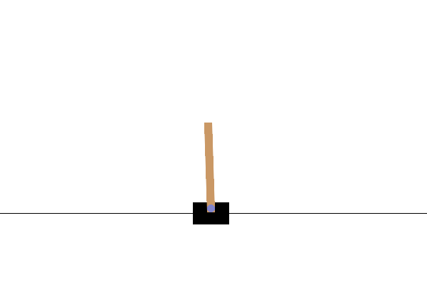
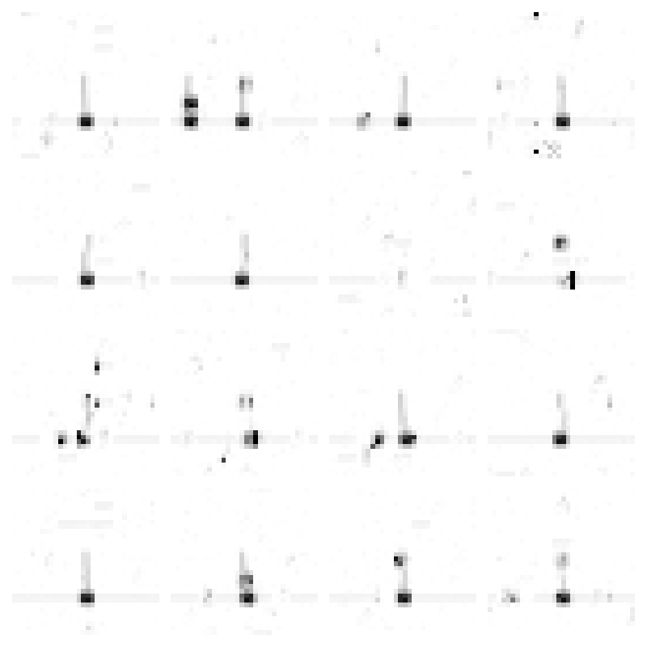

# CSCI8980_Active_Inference_Agent
Project for CSCI 8980 AI for sequential decision making

args.py contains all the arguments you should need to alter if you want to train the RG-flow model, theres a shell script that has an examlpe prompt
main_agent.py will run the agent on cartpole. The RG-flow model weights cant be uploaded here so it should run but it wont learn anything

main_sequential.py is for training the RG-Flow model

pdp_model.py contains the implementation of the Poisson Dirichlet Process used in the paper. The fit function is most likely where all the main implementation details are. Theres a large example implementation at the bottom of this file that you can uncomment and run and it will fit the pdp to some artifical dataset and plot the results. 

HMM_agent contains the HMM model and acts as a wrapper for the RG-flow model and pdp_model. 
- The infer function implements the update and plan loop. update_priors has all of the prior update rules.
- rollout_predictive_trajectory will have the agent genrate a trajectory over future states.
- _get_messages is the main implementation of the HMM. Looking at moving to a better library for implementing HMM's since this function is a mess but it seems to work.
- init_priors has all of the prior distribution initializations.

the layers folder contains everything for building the structure of the RG flow model. Main files are:
-hierarchy.py - backbone of the flow model. Takes in data and maps it to the latent space using rnvp layers
-resnet.py - implements neural nets within rnvp - currently using the transformer implementation over the basic mlp though its still labeled resnet
-rnvp.py - implements the affine transforms for the normalizing flow
-mera.py - builds indices for getting observations and latents, used for building hierarchy

the sources folder contains all of the target distribution files.
-gamma.py is the one currently used by the model.

