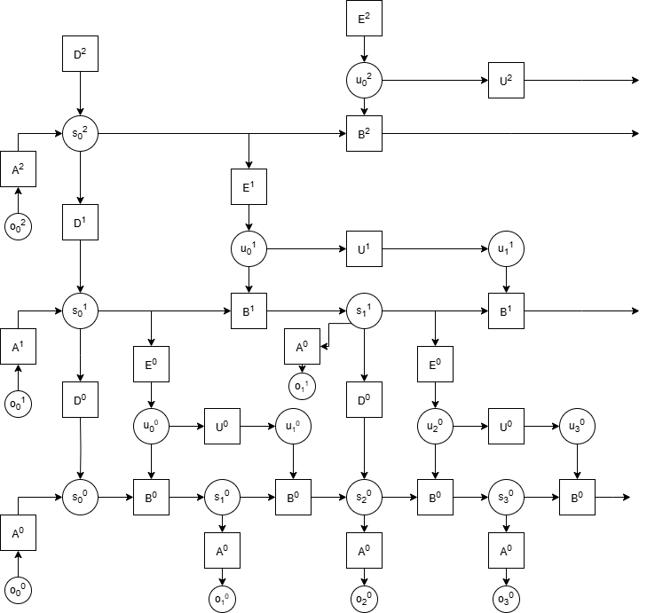

# CSCI8980_Active_Inference_Agent
Project for CSCI 8980 AI for sequential decision making

Temporal Hierarchical HMM

Install the libraries from requirements.txt and then any of the files should run.
I would recommend running all of these on GPU as the flow model can be pretty computationally heavy.

- To run the agent you will first need to train the RG-flow model with main_sequential 
- run_command.txt has an example of how to run this with the correct settings.
- This will take around 2-4 hours depending on how much compute you have
- After training the flow model the weights will be saved to a folder within the directory that will be automatically accessed by main_agent.py
- so all you have to do is run main_agent.py after the RG-Flow model is trained. run_command.txt also has an example of this.

- args.py contains all the arguments you should need to alter if you want to train the RG-flow model, 

- main_agent.py will run the agent on cartpole. The RG-flow model weights cant be uploaded here so it should run but it wont learn anything

- main_sequential.py is for training the RG-Flow model

- pdp_model.py contains the implementation of the Poisson Dirichlet Process used in the paper. The fit function is most likely where all the main implementation details are.
- Theres a large example implementation at the bottom of this file that you can uncomment and run and it will fit the pdp to some artifical dataset and plot the results. 
- This file should run fine on cpu

- HMM_agent contains the HMM model and acts as a wrapper for the RG-flow model and pdp_model. 
- The infer function implements the update and plan loop. update_priors has all of the prior update rules.
- rollout_predictive_trajectory will have the agent genrate a trajectory over future states.
- _get_messages is the main implementation of the HMM. Looking at moving to a better library for implementing HMM's since this function is a mess but it seems to work.
- init_priors has all of the prior distribution initializations.

- the layers folder contains everything for building the structure of the RG flow model. Main files are:
-hierarchy.py - backbone of the flow model. Takes in data and maps it to the latent space using rnvp layers
-resnet.py - implements neural nets within rnvp - currently using the transformer implementation over the basic mlp though its still labeled resnet
-rnvp.py - implements the affine transforms for the normalizing flow
-mera.py - builds indices for getting observations and latents, used for building hierarchy

- the sources folder contains all of the target distribution files.
-gamma.py is the one currently used by the model.

Example of agent playing for an episode

Sampled sequences of 4 images from the sequential RG-Flow model

